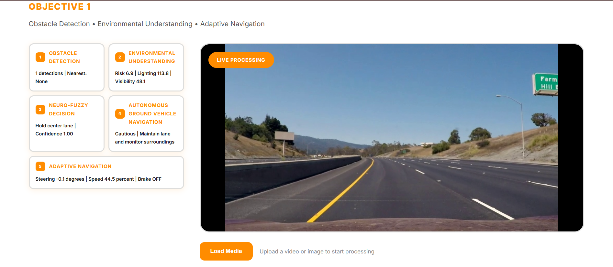
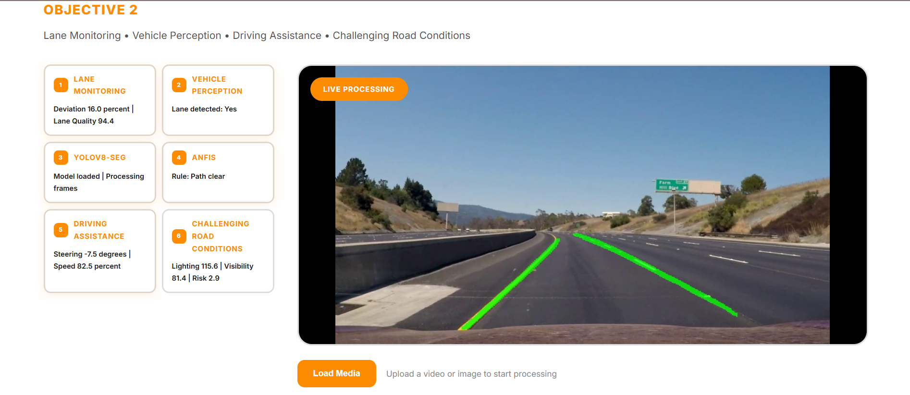
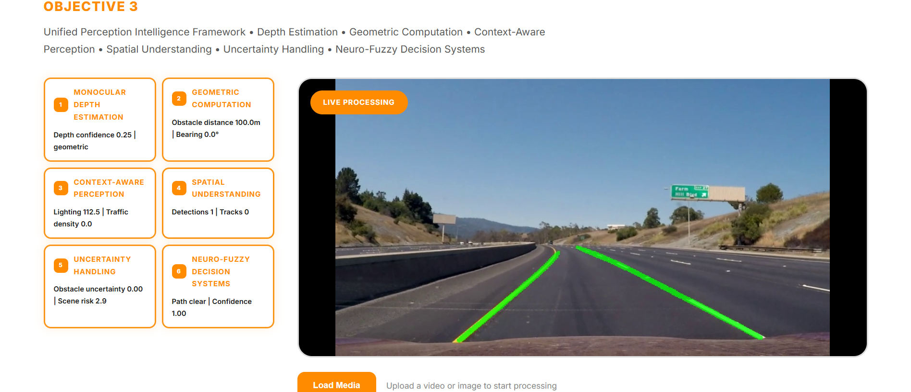
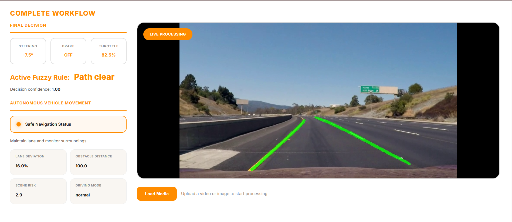

# Perception Intelligence for Autonomous Vehicles using Monocular Vision and Deep Learning

An autonomous driving perception and navigation platform integrating monocular vision, deep learning models, and Interval Type-2 Neuro-Fuzzy Logic for real-time risk assessment and vehicle control.

---

## Overview

The platform addresses perception and adaptive decision-making under uncertain environmental conditions:

1. **Objective 1 — Obstacle Detection & Adaptive Navigation**:
   - Open-vocabulary obstacle detection using **YOLOv8-World**
   - Multi-object tracking with Hungarian algorithm association
   - Relative depth estimation using monocular vision
   - Interval Type-2 Neuro-Fuzzy inference for collision avoidance steering and velocity commands

   

2. **Objective 2 — Lane Monitoring & Vehicle Perception**:
   - Sliding-window polynomial curve fitting for lane detection
   - Perspective transform (Bird's-Eye View) and lane curvature analysis
   - Vehicle offset calculation and trajectory prediction

   

3. **Objective 3 — Unified Perception Intelligence Framework**:
   - Comprehensive situational awareness combining lane analysis, obstacle spatial tracking, and depth cues
   - Dynamic danger assessment and automated collision warning / emergency braking

   

4. **Complete Workflow**:
   - End-to-end synchronized execution displaying live telemetry, fuzzy decision variables, and overlaid video streams

   

---

## System Flowchart

```
┌─────────────────────────────────────────────────────────────────────┐
│                        INPUT (Video / Camera)                       │
└──────────────────────────────┬──────────────────────────────────────┘
                               │
                ┌──────────────┴──────────────┐
                ▼                              ▼
┌───────────────────────┐        ┌────────────────────────┐
│  Obstacle Detection   │        │   Lane Segmentation    │
│    (YOLOv8-World)     │        │   (ONNX Deep Learning) │
└───────────┬───────────┘        └───────────┬────────────┘
            │                                │
            ▼                                ▼
┌───────────────────────┐        ┌────────────────────────┐
│  Multi-Object Tracking│        │  Connected Component   │
│  (Hungarian Algorithm)│        │  Analysis & Ego Lane   │
└───────────┬───────────┘        └───────────┬────────────┘
            │                                │
            ▼                                ▼
┌───────────────────────┐        ┌────────────────────────┐
│  Monocular Depth      │        │  Lane Deviation        │
│  Estimation (MiDaS)   │        │  Calculation           │
└───────────┬───────────┘        └───────────┬────────────┘
            │                                │
            └──────────────┬─────────────────┘
                           ▼
              ┌────────────────────────┐
              │ Scene Understanding   │
              │ • Risk Score          │
              │ • Driving Mode        │
              │ • Traffic Density     │
              │ • Lighting Conditions │
              └───────────┬────────────┘
                          ▼
              ┌────────────────────────┐
              │ Interval Type-2       │
              │ Neuro-Fuzzy Decision  │
              │ System                │
              │ (ANFIS Controller)    │
              └───────────┬────────────┘
                          ▼
         ┌────────────────────────────────┐
         │       Decision Output          │
         │  ┌──────────┬────────┬───────┐ │
         │  │ Steering │ Brake  │Throttle│ │
         │  │  Angle   │ Status │ Speed │ │
         │  └──────────┴────────┴───────┘ │
         └────────────────┬───────────────┘
                          ▼
              ┌────────────────────────┐
              │  Vehicle Controller   │
              │  (Adaptive Navigation)│
              └───────────┬────────────┘
                          ▼
              ┌────────────────────────┐
              │  Flask Web Interface  │
              │  • Live Video Feed    │
              │  • Real-time Telemetry│
              │  • Pipeline Monitoring│
              └────────────────────────┘
```

---

## Fuzzy Logic Rules

### Input Variables & Membership Functions

**Lane Deviation** (distance from lane center):

| Linguistic Term | Center | Spread | Width |
|---|---|---|---|
| far_left | -100 | 15 | 25 |
| left | -50 | 15 | 25 |
| center | 0 | 10 | 20 |
| right | 50 | 15 | 25 |
| far_right | 100 | 15 | 25 |

**Obstacle Distance** (meters to nearest obstacle):

| Linguistic Term | Center | Spread | Width |
|---|---|---|---|
| critical | 0 | 10 | 20 |
| close | 30 | 10 | 20 |
| medium | 60 | 15 | 25 |
| far | 100 | 20 | 30 |

**Traffic Density** (number of nearby objects):

| Linguistic Term | Center | Spread | Width |
|---|---|---|---|
| low | 0 | 2 | 4 |
| medium | 5 | 2 | 3 |
| high | 10 | 3 | 5 |

**Lighting Conditions** (pixel brightness):

| Linguistic Term | Center | Spread | Width |
|---|---|---|---|
| night | 50 | 30 | 40 |
| day | 180 | 50 | 70 |

### Output Variables & Consequents

**Steering Angle** (degrees):

| Linguistic Term | Value |
|---|---|
| hard_right | 45 |
| right | 25 |
| straight | 0 |
| left | -25 |
| hard_left | -45 |

**Speed Control** (percentage):

| Linguistic Term | Value |
|---|---|
| stop | 0 |
| slow | 30 |
| medium | 60 |
| fast | 100 |

### Rule Base

The fuzzy inference system uses 13 rules across four input variables (Lane Deviation, Obstacle Distance, Traffic Density, Lighting) to produce two outputs (Steering Angle, Speed Control).

| Rule | Condition | Action | Description |
|---|---|---|---|
| 1 | Lane is **far_left** | Steer **hard_right** (45°), Speed **medium** (60%) | Correct hard right when far left of lane |
| 2 | Lane is **left** | Steer **right** (25°), Speed **medium** (60%) | Steer right to correct left drift |
| 3 | Lane is **center** | Steer **straight** (0°), Speed **fast** (100%) | Hold straight when centered in lane |
| 4 | Lane is **right** | Steer **left** (-25°), Speed **medium** (60%) | Steer left to correct right drift |
| 5 | Lane is **far_right** | Steer **hard_left** (-45°), Speed **medium** (60%) | Correct hard left when far right of lane |
| 6 | Obstacle is **critical** | Speed **stop** (0%) | Emergency brake for critical obstacle |
| 7 | Obstacle is **close** | Speed **slow** (30%) | Reduce speed when obstacle is close |
| 8 | Lane is **center** and Obstacle is **close** | Steer **left** (-25°), Speed **slow** (30%) | Evasive steer left for centered close obstacle |
| 9 | Obstacle is **medium** | Speed **medium** (60%) | Maintain cruising speed for medium distance |
| 10 | Obstacle is **far** | Speed **fast** (100%) | Full speed when path is clear |
| 11 | Traffic Density is **high** | Speed **slow** (30%) | Cautious speed in dense traffic |
| 12 | Lighting is **night** | Speed **medium** (60%) | Reduced speed at night |
| 13 | Obstacle is **medium** and Density is **high** and Lighting is **night** | Speed **slow** (30%) | Very cautious in night + dense traffic |

---

## Directory Structure

```text
├── app.py                          # Application entry point
├── pyproject.toml                  # Build and package metadata
├── requirements.txt                # Python dependencies
├── README.md                       # Project documentation
│
├── src/
│   └── autonomous/
│       ├── __init__.py             # Package exports
│       ├── api/                    # Web application layer
│       │   ├── app.py              # Flask server and route handlers
│       │   ├── templates/          # Jinja2 HTML templates
│       │   │   ├── base.html
│       │   │   ├── overview.html
│       │   │   ├── objective1.html
│       │   │   ├── objective2.html
│       │   │   ├── objective3.html
│       │   │   └── complete_workflow.html
│       │   └── static/             # Static web assets
│       │       └── css/
│       │           └── main.css
│       ├── config/                 # Settings & parameters
│       │   ├── __init__.py
│       │   └── settings.py
│       ├── control/                # Actuator & speed control
│       │   ├── __init__.py
│       │   └── vehicle_controller.py
│       ├── core/                   # Interval Type-2 Neuro-Fuzzy logic
│       │   ├── __init__.py
│       │   └── neuro_fuzzy.py
│       ├── navigation/             # Adaptive navigation planner
│       │   ├── __init__.py
│       │   └── adaptive_navigator.py
│       ├── perception/             # Vision pipelines
│       │   ├── __init__.py
│       │   ├── depth_estimator.py
│       │   ├── lane_detector.py
│       │   ├── obstacle_detector.py
│       │   ├── advanced_lane_detector.py
│       │   └── scene_understanding.py
│       └── tracking/               # Object tracking
│           ├── __init__.py
│           └── object_tracker.py
│
├── models/                         # Model weights directory (.gitignored)
├── uploads/                        # Uploaded test media (.gitignored)
├── logs/                           # System and debug logs (.gitignored)
└── tests/                          # Automated test suite
```

---

## Installation

### 1. Clone & Setup Environment

```bash
git clone <repo-url>
cd "fuzzy system"

# Create a virtual environment
python -m venv venv
source venv/bin/activate    # On Linux/macOS
# or
.\venv\Scripts\activate     # On Windows
```

### 2. Install Dependencies

```bash
pip install -r requirements.txt
```

---

## Running the Web Interface

Start the Flask server:

```bash
python app.py
```

Open your browser and navigate to:
```
http://127.0.0.1:5000/
```

### Available Routes

| Route | Description |
|---|---|
| `/` | System overview and pipeline selection portal |
| `/objective1` | Obstacle detection & adaptive navigation |
| `/objective2` | Lane monitoring & road curvature perception |
| `/objective3` | Unified perception intelligence framework |
| `/complete-workflow` | End-to-end integrated video pipeline & telemetry |
| `/api/telemetry` | Real-time JSON telemetry endpoint |
| `/video_feed` | Multipart JPEG video streaming route |

---

## License

Academic / Research use.
